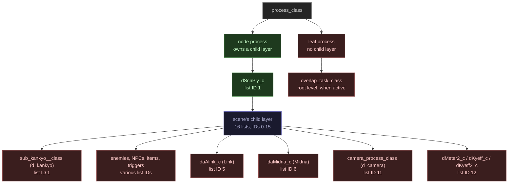
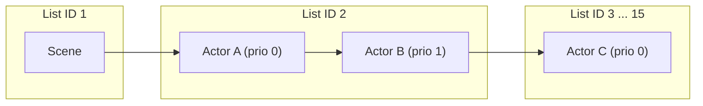
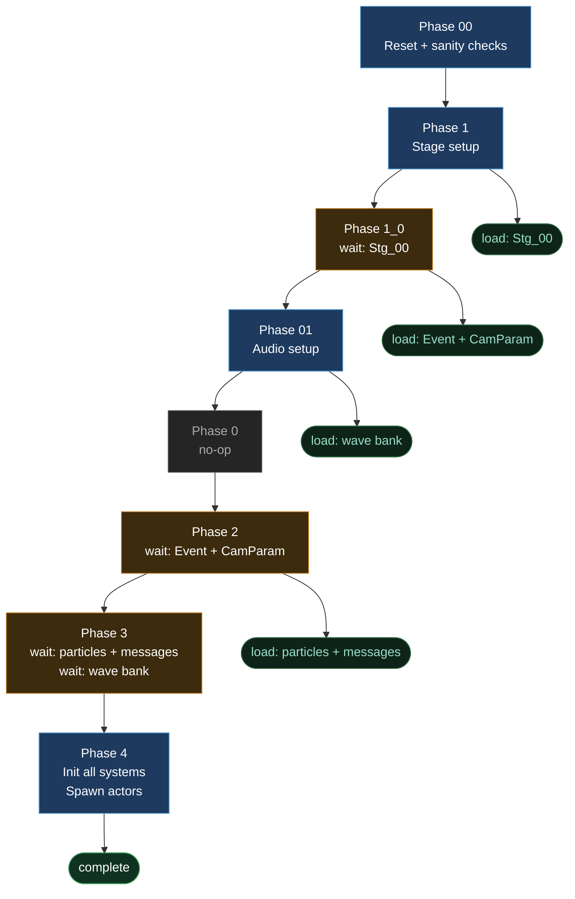

### Maddie's Note

> Yes I know this is really big and daunting. This game is complex and uses a lot of non-obvious vocabulary. I've done my best to define as many terms as possible in non-technical jargon to the fullest extent that it would still be useful. I've also included some diagrams. I promise that if you're patient and read carefully and present-mindedly, you might learn a thing or two, and maybe even have a little fun! Keep an eye out for more block-quotes with largely useless remarks as you continue on your journey.

## Glossary

### Process Framework

- <a id="gl-process"></a>**Process**: Anything managed by the process framework. Scenes, actors, cameras, and overlays are all processes with the same basic cycle: creation, execution every frame, drawing every frame, and deletion
  - <a id="gl-node-process"></a>**Node process**: A process that owns a child [layer](#gl-layer), making it responsible for a set of child processes. The play scene and room scene processes are the node processes during normal gameplay
  - <a id="gl-leaf-process"></a>**Leaf process**: A process with no child [layer](#gl-layer) and no children. All [actors](#gl-actor) are leaves
- <a id="gl-layer"></a>**Layer**: How the framework tracks process ownership and lifetime. Every process lives in exactly one layer. When a [node process](#gl-node-process) is deleted, its child layer and every process in it are deleted automatically. A new process joins whichever layer is current when it is created; node processes redirect that pointer to their own child layer during their create and execute, so actors spawned during scene setup land in the right layer. Layers are entirely separate from the [line queue](#gl-line-queue): layers are about ownership, the line queue is about execution order
- <a id="gl-line-queue"></a>**Line queue**: A set of 16 execution groups (one per [list ID](#gl-list-id)). Within each group, processes run in [list priority](#gl-list-priority) order. Room processes run at [list ID](#gl-list-id) 0, the scene at 1, and actors at 2 and above, lower ID always runs first
  - <a id="gl-list-id"></a>**List ID**: A category number (0-15) stored in a process's [profile](#gl-profile) that determines which of 16 execution groups it belongs to. Many processes share the same [list ID](#gl-list-id); it is a grouping, not a unique identifier. Groups execute in ascending order: [list ID](#gl-list-id) 1 before [list ID](#gl-list-id) 2, and so on 
    - *Separate from the process's runtime unique ID `fpc_ProcID`, which identifies a specific instance*
  - <a id="gl-list-priority"></a>**List priority**: Controls where within its [list ID](#gl-list-id) group a process executes. Lower priority runs earlier. Processes sharing a [list ID](#gl-list-id) are ordered by priority at insertion time.
- <a id="gl-profile"></a>**Profile** (`process_profile_definition`): A shared blueprint for all instances of the same process type. Stores the default [list ID](#gl-list-id), [list priority](#gl-list-priority), process size, and a pointer to a method table with create, execute, and delete functions. The [list ID](#gl-list-id) and priority are copied into the process at creation
- <a id="gl-phase-handler"></a>**Phase handler**: A pattern for spreading work across multiple frames. Each step signals what to do next by returning one of:
  - `cPhs_NEXT_e`: this step is done; immediately advance to and run the next step in the same frame
  - `cPhs_INIT_e`: not done yet, run this step again next frame
  - `cPhs_COMPLEATE_e`: the whole sequence is complete
    - > Yes, "COMPLEATE" is a typo, we must live with it. The debug symbol table knows best.

- <a id="gl-create-method"></a>**Create method**: Runs [multiple phases](#gl-phase-handler) over one or more frames to set up a process and load its assets. When complete, the process joins the [line queue](#gl-line-queue) and begins executing
- <a id="gl-execute-method"></a>**Execute method**: Runs once per frame to update a process's game logic. For the scene this is where the event and cutscene systems tick. For actors this can include:
  - input reading
  - physics
  - collision
  - animation
  - state transitions
  - etc.
- <a id="gl-draw-method"></a>**Draw method**: Runs once per frame to render a process. For actors this is where geometry is submitted to the GPU; the scene's draw method also runs particle simulation and walks the [draw tag queue](#gl-draw-tag-queue)
  - <a id="gl-draw-tag-queue"></a>**Draw tag queue** (`g_fopDwTg_Queue`): A persistent sorted list actors are added to once when they finish creating, ordered by draw priority. The scene walks it every draw phase to render actors in the correct order. Separate from the [line queue](#gl-line-queue), which only controls when logic runs
- <a id="gl-delete-method"></a>**Delete method**: Called once when a process is removed. Tears down game state, removes the process from the [line queue](#gl-line-queue), and frees its memory
- <a id="gl-pause-flag"></a>**Pause flag**: A per-process flag that can independently halt execute (flag 1) or draw (flag 2). The scene-wide pause flag (`dComIfGp_isPauseFlag()`) shuts down:
  - the event system
  - the cutscene system
  - vibration
  - particles
  - background object movement
- <a id="gl-pause-timer"></a>**Pause timer**: A countdown timer on the scene (`dScnPly_c::pauseTimer`). While it's nonzero, the scene's execute aborts immediately, freezing all game logic for that frame. Used primarily for hitstun
- <a id="gl-overlay"></a>**Overlay**: A [leaf process](#gl-leaf-process) (`overlap_task_class`) that plays a screen transition animation (fade to black, white, etc.). At most one is active at a time. See also: [Wipe / Overlap](#gl-wipe)

### Game Objects

- <a id="gl-gameinfo"></a>**Game info** (`g_dComIfG_gameInfo`): The global game state object. Every `dComIfG*` accessor in the codebase reads from or writes to this one object. Created once at boot and reset on each scene teardown. Holds:
  - save data and persistent flags
  - runtime state: current and next stage, particles, simple models, vibration
  - the draw list and resource manager
- <a id="gl-scene"></a>**Scene**: A [node process](#gl-node-process) that owns a distinct game state. Scene types include gameplay (`dScnPly_c`), menus, and the logo screen; exactly one is active at a time. During gameplay, the play scene manages all actors in the current area through its child [layer](#gl-layer)
- <a id="gl-actor"></a>**Actor**: Any game object that exists in the world and runs logic each frame. Each has an execute method and usually a draw method. Exists as a [leaf process](#gl-leaf-process). Examples:
  - Link, Midna
  - enemies, NPCs
  - doors, switches, items
  - invisible triggers

### Stage Structure and Loading

- <a id="gl-stage"></a>**Stage**: A self-contained section of the game world with its own actor layout, geometry, and data files. The scene is the in-code object that loads and owns the current stage. Every time the player moves between areas, the old stage is unloaded and a new one is loaded in its place
  - <a id="gl-room"></a>**Room**: A spatial subdivision within a stage. A stage contains one or more rooms; each room has its own actor layout (described in a DZR file) and is managed by a `dScnRoom_c` scene process ([list ID](#gl-list-id) 0) that loads and unloads room data independently as the player moves through the area. Room transitions do not unload the full stage
  - <a id="gl-dzrs"></a>**DZS / DZR**: Binary data files that describe which actors to spawn. DZS covers the whole stage; DZR covers individual rooms. `dStage_Create()` reads these to spawn everything
  - <a id="gl-archive"></a>**Archive**: A compressed file container (`.arc`) that groups related assets for loading from disc. Stage geometry, particle definitions, audio wave banks, and message text each live in separate archives. Loading an archive is asynchronous; the game waits on it before proceeding
    - <a id="gl-stg00"></a>**Stg_00**: The shared stage archive loaded at the start of every stage. Contains geometry and textures used across the whole area. A second archive, Xtg_00, holds additional shared data

### Simulation Systems

- <a id="gl-suspend"></a>**Actor suspend system** (`daSus_c`): Manages designer-placed suspension zones that put off-screen actors into a dormant state, skipping their execute each frame
- <a id="gl-bgsp"></a>**Bgsp** (background space, `dComIfG_Bgsp()`): Holds the world's static and dynamic collision geometry. Actors query it during execute for ground, wall, roof, and water checks; moving objects (platforms, doors) have their geometry stepped during draw via `Move()`
- <a id="gl-ccsp"></a>**Ccsp** (collision shape space, `dComIfG_Ccsp()`): Holds actor collision shapes (spheres, cylinders, etc). Actors update shape positions via `setCollision()` during execute; detection runs at the start of draw via `Move()`, which tests attack shapes against target shapes and correction shapes (push colliders that physically separate overlapping actors) against each other
- <a id="gl-attention"></a>**Attention system** (`dAttention_c`): Manages L-targeting. Iterates all live actors each frame, scores candidates by a distance-and-angle weight function, and tracks lock-on state
- <a id="gl-event"></a>**Event system** (`dEvt_control_c`): The state machine for scripted interactions. Actors submit requests via `order()`; the scene calls `Step()` once per frame to advance the active event and start the next queued one
- <a id="gl-demo"></a>**Demo system** (`dDemo_c`): The cutscene playback system. Wraps [JStudio](#gl-jstudio) with game-specific adapter objects, `dDemo_camera_c` for cameras and `dDemo_actor_c` for actors, that receive keyframe data as the sequence plays. Sequences are STB binary files

### Screen Transitions

- <a id="gl-wipe"></a>**Wipe / Overlap**: The screen transition effect between stages (fade to black, white flash, etc.). Managed by the overlap system (`fopOvlpM`). While a wipe is playing, the scene is paused and in "peek" mode
  - <a id="gl-peek"></a>**Peek**: The window during a wipe transition where the old scene is frozen and the new one hasn't started yet. BGM startup and pause timer logic are skipped during peek

### Rendering

- <a id="gl-display-list"></a>**Display list**: A pre-recorded sequence of GPU commands on the GameCube. Draw calls are written into the list once at load time and then replayed each frame in a single call, which is cheaper than re-issuing the commands individually
  - <a id="gl-simple-model"></a>**Simple model**: Fixed background geometry (floors, walls, scenery) that can't move or change. At scene setup, the game pre-records its draw commands into [display lists](#gl-display-list), one per model group. Those lists replay at the very end of each frame: cheaper than re-submitting each piece individually

### Platform and Libraries

- <a id="gl-aram"></a>**ARAM**: Audio RAM, a separate memory pool on the GameCube dedicated to audio data
- <a id="gl-jstudio"></a>**JStudio**: Nintendo's animation sequencer library. Parses STB binary cutscene files and drives playback by pushing each frame's keyframe data to registered adapter objects (cameras and actors). Used via [`dDemo_c`](#gl-demo)
- <a id="gl-z2audio"></a>**Z2Audio**: The audio library the game uses. `mDoAud_Execute()` submits commands to it once per frame after all game logic finishes

---

## The Process Framework

The game uses a "process framework" (f_pc) to track every active game object. Scenes, [actors](#gl-actor), cameras, [overlays](#gl-overlay), and UI elements are all "[processes](#gl-process)" with the same basic lifecycle: they get created, run logic once per frame, and eventually get deleted.

- Processes take one of two forms: [**node**](#gl-node-process) processes own a child layer (the play scene and room processes are nodes during gameplay), [**leaf**](#gl-leaf-process) processes do not (actors are leaves)
- Every process lives in a [**layer**](#gl-layer), which tracks ownership. When the scene is deleted on a stage transition, the framework walks its child layer and deletes everything in it automatically
- All processes are also tracked in a flat [**line queue**](#gl-line-queue) sorted by [list ID](#gl-list-id) and [list priority](#gl-list-priority), which determines the execution order each frame. Layers and the line queue are entirely separate: a process's layer says nothing about when it runs
- Each process has an [**execute method**](#gl-execute-method) (logic) and a [**draw method**](#gl-draw-method) (rendering), both called once per frame
- Processes can be [**paused**](#gl-pause-flag) for execute and draw independently
- Actors are added to the [**draw tag queue**](#gl-draw-tag-queue) once when they finish creating, sorted by draw priority. The scene's draw function walks this queue to render them in the correct order

**Process types and their runtime instances**, organized by the layer they live in:

> Sorry for making the ugliest diagram of all time



**Line queue**, the execution order derived from the tree. Every process gets a slot; lower [list ID](#gl-list-id) runs first, processes in the same [list ID](#gl-list-id) slot sorted by [list priority](#gl-list-priority):

> Here's a prettier one to make up for it



---

## Startup Sequence

- `main()` ([m_Do/m_Do_main.cpp](https://github.com/zeldaret/tp/blob/main/src/m_Do/m_Do_main.cpp))
  - Records power-on time
  - Runs a version check
  - Allocates reset data from the arena and sets up reset state flags
  - Determines development mode from the disc ID
  - Creates a new OS thread running `main01()`, starts it, then suspends the boot thread
- `main01()` ([m_Do/m_Do_main.cpp](https://github.com/zeldaret/tp/blob/main/src/m_Do/m_Do_main.cpp))
  - `mDoMch_Create()`: sets up:
    - all the memory heaps
    - the OS exception manager
    - [RNG](/posts/random-number-generation) seed
    - DVD error thread and memory card thread
  - `mDoGph_Create()`: sets up:
    - the framebuffer
    - Z-buffer
    - display lists
  - `mDoCPd_c::create()`: sets up the controller pad
  - `fapGm_Create()` ([f_ap/f_ap_game.cpp](https://github.com/zeldaret/tp/blob/main/src/f_ap/f_ap_game.cpp)):
    - `fpcM_Init()`: creates the root layer with 10 node lists (for [list ID](#gl-list-id)s 0-9, used by top-level processes: the scene and overlays) and the global [line queue](#gl-line-queue). Node processes like the scene get their own child layer with 16 node lists (0-15) when they are created, which is where actors and cameras live
    - `fopScnM_Init()`, `fopOvlpM_Init()`, `fopCamM_Init()`: scene, overlap, and camera manager initialization (all empty stubs at this stage)
    - `fopDwTg_CreateQueue()`: creates the [draw tag queue](#gl-draw-tag-queue), the persistent sorted list actors are added to once when they finish creating
  - Drops into the infinite game loop

---

## The Mainloop ([m_Do/m_Do_main.cpp](https://github.com/zeldaret/tp/blob/main/src/m_Do/m_Do_main.cpp))

The loop runs continuously. The play scene sets the tick rate to 30 Hz (`OS_TIMER_CLOCK / 30`), targeting 30 FPS. Some other scenes (logo, menu) run at 60 Hz.

- ### 1. Read Controller Input
  - `mDoCPd_c::read()`
    - Reads all connected controllers
    - Updates button states, analog sticks, and trigger values
    - Updates rumble motor state

- ### 2. Execute
  `fapGm_Execute()` ([f_ap/f_ap_game.cpp](https://github.com/zeldaret/tp/blob/main/src/f_ap/f_ap_game.cpp)) calls `fpcM_Management` ([f_pc/f_pc_manager.cpp](https://github.com/zeldaret/tp/blob/main/src/f_pc/f_pc_manager.cpp)), which runs the full game logic and rendering pipeline for the frame.

  - #### Reset the matrix stack `MtxInit()`
    - Resets `calc_mtx` to the start of a 10-slot scratch matrix array. During a frame, actors push and pop this stack (`MtxPush()`/`MtxPull()`) to compose hierarchical transforms (e.g. a child joint inheriting a parent's transform).
  - #### Read last frame's depth data: `dComIfGd_peekZdata()`
    - Pulls back the Z-depth sample written during the previous frame, used for effects
  - #### Shutdown error check: `dShutdownErrorMsg_c::execute()`
    - If a shutdown error is pending, everything below is skipped and an error screen takes over instead
  - #### DVD error check: `dDvdErrorMsg_c::execute()`
    - If the disc fails to read:
      - game time stops (`dLib_time_c::stopTime()`)
      - all sounds pause (`pauseAllGameSound(true)`)
      - controller rumble stops (`stopMotorWaveHard()`)
    - If the error clears, game time and sounds resume; rumble does not
      > The hidden technique we needed all along, rumble cancel

  - #### Clear the framebuffer: `cAPIGph_Painter()`
    - Clears the color and depth buffers so the new frame starts fresh

  - #### Delete queued objects ([f_pc/f_pc_deletor.cpp](https://github.com/zeldaret/tp/blob/main/src/f_pc/f_pc_deletor.cpp))
    - If the game was paused last frame, deletion is skipped this frame instead
      - *Particles hold references to their owning processes; deleting immediately after a paused draw risks a dangling pointer, so the pause path defers removals by one frame via a lock flag*
    - For each process waiting to be removed: removes it from the [line queue](#gl-line-queue), calls its [`delete_method`](#gl-delete-method) to clean up, unregisters it from its parent layer, and frees its memory

  - #### Apply any priority changes ([f_pc/f_pc_priority.cpp](https://github.com/zeldaret/tp/blob/main/src/f_pc/f_pc_priority.cpp))
    - Relocates any processes that requested a new [line queue](#gl-line-queue) position before logic runs

  - #### <a id="creation-handler"></a>Create new objects ([f_pc/f_pc_creator.cpp](https://github.com/zeldaret/tp/blob/main/src/f_pc/f_pc_creator.cpp))
    - Works through all pending creation requests. Most actors aren't created instantly; the framework calls their [`create_method`](#gl-create-method) over multiple frames with [phases](#gl-phase-handler) until loading finishes
    - When a process finishes creation, it gets marked ready and inserted into the [line queue](#gl-line-queue). If it's a [node](#gl-node-process), its children get inserted too

  - #### Run logic for every object ([f_pc/f_pc_executor.cpp](https://github.com/zeldaret/tp/blob/main/src/f_pc/f_pc_executor.cpp))
    - Walks the global [line queue](#gl-line-queue) in order (lowest [list ID](#gl-list-id) first, then lowest [list priority](#gl-list-priority)). This is how the game guarantees the scene always ticks before its actors
    - For each process:
      - Skips it if it isn't fully initialized yet
      - Skips it if it's [execution-paused](#gl-pause-flag)
      - For actors specifically: checks whether its spawn position and current position are both inside a [suspension zone](#gl-suspend) and updates its suspend flag accordingly; if suspended, its execute is skipped for this frame
      - Otherwise sets the current [layer](#gl-layer) pointer to this process's layer and calls its [execute method](#gl-execute-method)

    - ##### [0] Room Processes: `dScnRoom_c` ([d/d_s_room.cpp](https://github.com/zeldaret/tp/blob/main/src/d/d_s_room.cpp))
        [Room](#gl-room) processes are node processes at [list ID](#gl-list-id) 0; actors they spawn live in the room's own child [layer](#gl-layer).
        - **Create**: spans multiple frames while the room archive loads asynchronously, then parses the [DZR](#gl-dzrs) and spawns actors
        - **Execute**: checks if the stage control system has flagged this room for deletion (rooms outside the preload set for Link's current position are flagged externally); if Link is in this room and actors in its layer are still being created, sets a 2-frame [pause timer](#gl-pause-timer) each frame until they finish
        - **Delete**: the framework automatically removes the room and all actors in its layer; the stage and shared geometry stay loaded

    - ##### [1] The Scene's Logic: `dScnPly_Execute` ([d/d_s_play.cpp](https://github.com/zeldaret/tp/blob/main/src/d/d_s_play.cpp))
        The [play scene](#gl-scene) has [list ID](#gl-list-id) 1, so it always runs before actors. This is where the [event](#gl-event) and [cutscene](#gl-demo) systems tick for the frame.

        - Clears the scene's reset flag and room-change flags
        - **Music startup and [pause timer](#gl-pause-timer)** (skipped while in a [wipe's peek](#gl-peek) phase):
          - If the BGM-not-started flag is set:
            - `mDoAud_sceneBgmStart()`: starts background music for this scene
            - `mDoAud_load2ndDynamicWave()`: starts loading the secondary audio wave bank
            - Clears the BGM-not-started flag
          - `calcPauseTimer()`: counts down the pause timer; if it's still nonzero, the function aborts early and skips everything else this frame
        - `dKy_itudemo_se()`: plays the room's persistent ambient sound effect (also skipped during peek and when the pause timer causes an early return above)
        - **Main logic** (skipped if the [pause flag](#gl-pause-flag) is set):
          - `dDemo_c::update()`: steps the [cutscene system](#gl-demo) one frame
            - Advances the [JStudio](#gl-jstudio) playhead one frame; JStudio pushes that frame's keyframe data to registered adapter objects for actors and cameras
            - Message triggers in the stream call `dMsgObject_setDemoMessage()` to post events to the [event system](#gl-event)
            - When the playhead reaches the end, signals the [event system](#gl-event) to run cutscene cleanup next frame
          - `dComIfGp_getEvent()->Step()`: advances the [event system](#gl-event) one frame
            - The system is in one of four modes: WAIT (idle), TALK, DEMO, or COMPULSORY. `Sequencer()` advances the active event one phase; when it finishes, `entry()` starts the highest-priority pending request whose conditions pass
            - Handles skip input and blocks [attention system](#gl-attention) updates while any event is running
            - *Requests are submitted via `order()` during actor execute; up to 8 are queued and sorted by priority (lower value = higher priority)*
          - `dComIfGp_getAttention()->Run()`: updates the [attention system](#gl-attention)
            - If an event is running, releases lock-on and returns early
            - Otherwise steps the NONE/LOCK/RELEASE state machine: NONE waits for L-trigger input and builds a scored candidate list; LOCK re-evaluates the target each frame and transitions to RELEASE if it fails; RELEASE counts down before returning to NONE
            - Updates nearest-enemy state for danger BGM and cursor animation

    - ##### [2+] Actor Logic
      **Example: Link** (`daAlink_c::execute()`, [list ID](#gl-list-id) 5):

      1. **Platform and mount sync**:
          - snap position to any moving surface Link is standing on
          - sync facing angle for riding/grabbed states (Epona, boar, magnet boots, vines)
      2. **Per-frame reset**:
          - zero timers and button-status flags
          - refresh pointers to nearby enemies and held/equipped items
          - count down per-frame timers (oxygen, damage invincibility, sword-flourish, dash, guard-slip, etc.)
          - advance animation playback
      3. **State machine**: `(this->*mpProcFunc)()`, the current action handler runs all per-state logic for this frame (walking, swimming, climbing, attacking, demo-controlled, etc.)
      4. **Physics**:
          - `posMove()` integrates velocity into position
          - `mLinkAcch.CrrPos()` resolves ground, wall, ceiling, and water against world geometry and records surface type and footstep sound
      5. **Model and world-space update**:
          - finalize joint positions (`modelCalc()`)
          - move hitboxes/hurtboxes to the new position (`setCollision()`)
          - update the L-target anchor, dynamic lighting, and particle attachment points
      6. **Interaction flags**: set event-condition flags (talk, grab, door, item pickup) based on ground state and current mode
      7. **HUD sync**: update which action prompts appear on-screen based on what the state machine decided

    - ##### Always-Present Processes
      Aside from stage-specific actors, certain processes are created during scene setup and run every gameplay frame for the whole session. The [list ID](#gl-list-id) ordering means they always execute in this sequence:

        | Process                           | List ID | What it does each frame                                                                                   |
        | --------------------------------- | ------- | --------------------------------------------------------------------------------------------------------- |
        | `sub_kankyo__class` (d_kankyo)    | 1       | Updates environment lighting, wind, time-of-day, and twilight color palette                               |
        | `daAlink_c` (Link)                | 5       | Player logic (see above)                                                                                  |
        | `daMidna_c` (Midna)               | 6       | Midna logic: riding state, floating/dialogue position, her own model and collision                        |
        | `camera_process_class` (d_camera) | 11      | Runs the active camera, computes the view matrix, handles demo camera                                     |
        | `dMeter2_c` (d_meter2)            | 12      | Controls all HUD elements: health, rupees, keys, oxygen, lantern oil, light drops, item buttons, mini-map |
        | `dKyeff_c` (d_kyeff)              | 12      | Steps weather simulation, wolf senses visual effect, and ambient environment sounds                       |
        | `dKyeff2_c` (d_kyeff2)            | 12      | Steps the vrkumo simulation, used for certain cloud skyboxes                                              |

        [List ID](#gl-list-id) 12 processes share the same group. All three use `fpcPi_CURRENT_e` (no fixed priority, take whatever slot is current at insertion), so their order is determined by creation order: d_meter2 is spawned first, then d_kyeff and d_kyeff2 in `dKankyo_create()`.

      - ###### sub_kankyo__class (d_kankyo)
          Runs at [list ID](#gl-list-id) 1. `exeKankyo()` builds all per-frame lighting and environment state before any actor executes:
          - Blends the in-game time of day across up to 11 scheduled light configurations to produce the scene's per-frame lighting: scene lights, fog, sky color, and color registers
          - Updates the global wind vector (direction, strength, radius) consumed by particle emitters and wind-reactive actors
          - When in the twilight, overrides lighting and fog with twilight-specific palette data

      - ###### camera_process_class (d_camera)
          Runs at [list ID](#gl-list-id) 11, after all actors. 
          - Per-frame execute:
            - Selects from 20 named camera engine implementations (chase, lock-on, talk, fixed, rail, hookshot, event, and others) based on the current camera mode, which is set by player action state, room-default camera data, or camera trigger actors placed by level designers
            - Runs the active engine to compute the camera's position, look-at target, and orientation, with bg collision correction to prevent clipping into geometry
            - Applies the resulting view matrix

          During cutscenes, `dDemo_camera_c` takes ownership of specific parameters; the gameplay camera defers those to JStudio and resumes full control when the cutscene ends.

- ### 3. Draw
  **How execution leads into drawing.** All logic runs first in line queue order; then the scene's draw method walks the draw tag queue (populated at actor creation) to render every actor:

  ```mermaid
  flowchart LR
      subgraph exec ["Execute phase (line queue order)"]
          SceneEx["Scene execute()<br/>list ID 1"]
          ActorEx["Each actor's execute()<br/>list ID 2+"]
          SceneEx -.-> ActorEx
      end

      subgraph draw ["Draw phase"]
          SceneDr["Scene draw()<br/>walks DTQ low to high priority"]
          ActorDr["Each actor's draw()<br/>submits geometry to GPU"]
          SceneDr --> ActorDr
      end

      exec --> draw
  ```

  - #### Rendering the frame ([f_pc/f_pc_draw.cpp](https://github.com/zeldaret/tp/blob/main/src/f_pc/f_pc_draw.cpp))
    - `cAPIGph_BeforeOfDraw()`: sets up GPU render state and projection matrices
    - Walks only the root layer (not child layers). The scene draws all its actors internally; the [overlay](#gl-overlay), when active, also draws from here (rendering the fade/transition effect)
    - For each root-level process: skips it if [draw-paused](#gl-pause-flag), otherwise calls its [draw method](#gl-draw-method)
    - `cAPIGph_AfterOfDraw()`: finalizes sending draw commands to the GPU

    - ##### The Scene's Render: `dScnPly_Draw` ([d/d_s_play.cpp](https://github.com/zeldaret/tp/blob/main/src/d/d_s_play.cpp))
        > Despite the name, this function also runs several simulation steps that need to happen after all execute logic has finished before anything is drawn

        - `dComIfG_Ccsp()->Move()`: runs actor-to-actor collision detection. This happens at the start of draw rather than during execute because every actor must have finished its execute (and called `setCollision()` to update its shape positions) before detection can run against a consistent world state. `Move()` tests attack vs target shapes and correction shapes, sets hit flags, fires callbacks, and clears the lists for next frame
        - `dComIfG_Bgsp().ClrMoveFlag()`: marks all [background collision](#gl-bgsp) objects as not-moved, so the next frame starts with a clean slate for tracking which objects are in motion
        - **Stage transition check** (skipped during a [wipe peek](#gl-peek) or when resetting to title):
          - If a next-stage has been flagged:
            - Looks up the [wipe](#gl-wipe) type for this transition
            - Posts a scene change request via `fopScnM_ChangeReq()`
            - Picks the fade color based on wipe type and current in-game time of day
        - `dMdl_mng_c::reset()`: resets the shared model manager for this frame
        - **Simulation steps** (skipped if `dComIfGp_isPauseFlag()` OR `dScnPly_c::isPause()` is set):
          - `dComIfGp_getVibration().Run()` (PLAY_SCENE only): fires off controller rumble commands based on requests actors submitted
          - `daSus_c::execute()`: updates the switch state of each active suspension zone (enabling or disabling the zone based on its associated game switch). The per-actor position check happens earlier during the execute phase, before each actor's own execute runs
          - `dComIfG_Bgsp().Move()`: steps all [moving collision objects](#gl-bgsp) one frame (moving platforms, rotating doors, etc.)
          - `dComIfGp_particle_calc3D()`: simulates all active 3D particle emitters
          - `dComIfGp_particle_calc2D()`: simulates all active 2D particle emitters
          - `cCt_execCounter()`: increments a global counter that only ticks on non-paused frames
        - **If either pause condition is true**:
          - `dPa_control_c::onStatus(1)`: sets the particle deletion-lock flag so particles won't be freed this frame
          - If only the global pause flag is set (not `dScnPly_c::isPause()`): also sets a flag that causes `calc3D()` to skip 3D particle simulation next frame
          - `dComIfGp_getVibration().Pause()`: stops controller rumble (only called when `dScnPly_c::pauseTimer == 0`)
        - **Draw every actor** via the [draw tag queue](#gl-draw-tag-queue), walking from lowest to highest draw priority
          - Each entry's [draw method](#gl-draw-method) submits geometry to the GPU
        - **Post-draw overlays** (skipped if `dComIfGp_isPauseFlag()` is set):
          - `dEyeHL_mng_c::update()`: draws eye highlights on characters
          - `attention->Draw()`: draws the [L-target cursor](#gl-attention) over the locked-on target

  - #### Scene transitions and wipes ([f_ap/f_ap_game.cpp](https://github.com/zeldaret/tp/blob/main/src/f_ap/f_ap_game.cpp))
    `fapGm_After()` runs after both execute and draw are done. This is where scene change requests from the draw phase actually get processed.

    - `fopScnM_Management()` ([f_op/f_op_scene_mng.cpp](https://github.com/zeldaret/tp/blob/main/src/f_op/f_op_scene_mng.cpp))
      - Processes any scene creation, deletion, or change requests posted this frame
      - For a transition with a [wipe](#gl-wipe), the swap takes place over several frames:
        1. Trigger the fade-out and wait for it to begin
        2. Wait for the fade-out to finish, the screen is now fully black or white
        3. [Delete the old scene](#destroying-a-stage) and [begin creating the new one](#loading-a-new-stage)
        4. Hold on the solid color ([peek](#gl-peek)) until the new scene is ready, then trigger the fade-in
        5. Wait for the fade-in to finish
        6. Unpause the new scene, gameplay resumes

      - For a transition with no wipe: skips the wipe animation phases and processes the scene swap immediately, though [new scene creation](#loading-a-new-stage) still spans multiple frames via the [creation handler](#creation-handler)
    - `fopOvlpM_Management()` ([f_op/f_op_overlap_mng.cpp](https://github.com/zeldaret/tp/blob/main/src/f_op/f_op_overlap_mng.cpp))
      - Steps the wipe/fade animation one frame forward
      - Clears the overlap slot once the wipe finishes or errors out
    - `fopCamM_Management()` ([f_op/f_op_camera_mng.cpp](https://github.com/zeldaret/tp/blob/main/src/f_op/f_op_camera_mng.cpp))
      - Currently an empty stub
        > We may only speculate about what this was supposed to do; alas this game must have some seriously mismanaged cameras

  - #### Draw pre-baked static geometry
    - `dComIfGp_drawSimpleModel()`, submits up to 8 groups of pre-compiled background [display lists](#gl-display-list)

  - #### **Tick frame counters**
    - `cCt_Counter(0)` runs after `fpcM_Management` returns, incrementing two global frame counters used by systems that track elapsed frames

- ### 4. Run Audio
  - `mDoAud_Execute()` ([m_Do/m_Do_audio.cpp](https://github.com/zeldaret/tp/blob/main/src/m_Do/m_Do_audio.cpp))
    - If the audio system is not initialized: calls `mDoAud_Create()` to start it up (happens once during boot)
    - If initialized, calls `g_mDoAud_zelAudio.gframeProcess()`, the per-frame [Z2Audio](#gl-z2audio) update that processes all queued sound commands for this frame

---

## Loading a New Stage

When the [creation handler](#creation-handler) builds a new play scene, `dScnPly_Create()` is called every frame until all loading [phases](#gl-phase-handler) complete.

> I have no idea why the phases are numbered like this sorry, it's just the way it is



Blue phases complete in a single frame; orange phases wait each frame until their required loads finish. Green nodes are the async loads started by the phase they branch from.

- `dScnPly_Create(scene)` ([d/d_s_play.cpp](https://github.com/zeldaret/tp/blob/main/src/d/d_s_play.cpp))
  - Uses [`dComLbG_PhaseHandler()`](#gl-phase-handler) to step through the phases above, one per frame

  - #### Phase 00: Reset and Sanity Checks
    - `resetGame()`: resets active archive banks, brightness, and fade/wipe state; waits one frame if the system isn't ready yet
    - `mDoGph_gInf_c::offBlure()`: turns off motion blur

  - #### Phase 1: Stage Setup and Begin Loading Stage Data
    - Registers this scene as the current [stage](#gl-stage) owner
    - Copies the queued next-stage info into the current stage slot
    - Applies hardcoded progression overrides (see [Area State Calculation](/posts/state-calculation) for how the game determines which state each area should load in)
    - Configures lighting based on twilight state
    - Resets the boss phase signal to uninitialized (`0xFF`): boss actors write to this field as they advance through phases, and environmental actors (water level, fog, background animation) read it to coordinate dungeon effects.
    - Starts loading "[Stg_00](#gl-stg00)" (the shared stage archive with geometry and textures)

  - #### Phase 1_0: Wait for Stage Data, Start Event and Camera Loads
    - Waits for [Stg_00](#gl-stg00) to finish loading; repeatedly waits a frame if still in progress
    - `dStage_infoCreate()`: parses stage info from the loaded archive
    - Initiates loading for the event data archive ("Event") and the camera parameter archive ("CamParam")

  - #### Phase 01: Audio Setup and Wave Bank Load
    - Passes the audio system the current time, stage name, room, layer, and twilight state so it can select the correct BGM and ambient sounds
    - Starts loading the first dynamic audio wave bank for this stage

  - #### Phase 0: Placeholder
    - Does nothing, advances immediately. Exists as a sequencing separator in the phase table

  - #### Phase 2: Wait for Event/Camera Data, Start Particle and Text Loads
    - Waits for all object resources (Event, CamParam, etc.) to finish loading
    - Looks up which particle set this stage and layer uses
    - Starts loading the scene's particle archive asynchronously into main RAM
    - Starts loading the stage-specific message (text/dialog) archive

  - #### Phase 3: Wait for Particles, Text, and Audio
    - Stalls until all three are ready:
      - particle archive
      - message archive
      - first dynamic audio wave bank

  - #### Phase 4: Initialize Everything and Spawn Actors
    All data is in memory at this point. This phase builds all the game systems and spawns every actor for the stage.

    - Finalizes the particle scene from the loaded archive
    - Mounts the stage message archive so dialog can be looked up
    - Calculates which map region this stage belongs to
    - Sets up background collision tracking ([`dComIfG_Bgsp().Ct()`](#gl-bgsp))
    - Clears all Bgsp physics query lists (line check, ground check, roof check, water check)
    - Sets up the [collision shape space](#gl-ccsp) (`dComIfG_Ccsp()->Ct()`)
    - Creates the [cutscene system](#gl-demo) (`dDemo_c::create()`) and eye highlight manager
    - If this is the opening scene: creates the title actor, initializes save data, and sets starting gear
    - Creates the path system and treasure system
    - `dStage_Create()`: reads [DZS/DZR](#gl-dzrs) data and spawns every actor defined for the stage (the area state calculated at this point, per [Area State Calculation](/posts/state-calculation), determines which actors are present and in what configuration)
    - Creates the [simple model](#gl-simple-model) buffer and model manager
    - Sets the frame tick rate to 30 Hz, allocates 2D render heaps, and configures viewport settings
    - Sets up the [attention system](#gl-attention) and controller vibration
    - Sets the BGM flag, resets brightness and the [pause timer](#gl-pause-timer), and clears any active fade-in

  - #### Loading Done
    - Returns `cPhs_COMPLEATE_e`
    - The [creation handler](#creation-handler) calls `fpcEx_ToExecuteQ`, which inserts the scene into its layer and the [line queue](#gl-line-queue) and marks it ready. The scene starts executing and drawing on the next frame

---

## Destroying a Stage

When the scene is deleted on a stage transition or title reset, `dScnPly_Delete()` runs ([d/d_s_play.cpp](https://github.com/zeldaret/tp/blob/main/src/d/d_s_play.cpp)):

- Clears the [suspend](#gl-suspend) actor list
- Removes the path system (`dMpath_c`): frees dungeon minimap texture objects and room/layer map data
- Removes the treasure system (`dTres_c`): clears the stage's registry of collectible item positions and status flags
- Destroys the [attention system](#gl-attention) and vibration system
- Destroys [background collision space](#gl-bgsp) and [collision shape space](#gl-ccsp)
- `dStage_Delete()`: deletes all stage actors and room data
- Removes the [event system](#gl-event) and scene particle system
- Unmounts the stage-specific message archive (`getMsgDtArchive(1)`)
- Removes the [cutscene system](#gl-demo) and frees 2D render heaps
- Deletes the [simple model](#gl-simple-model) buffer, model manager, and bloom buffer
- `dComIfGp_init()`: resets [game info](#gl-gameinfo) pointers back to null/defaults
